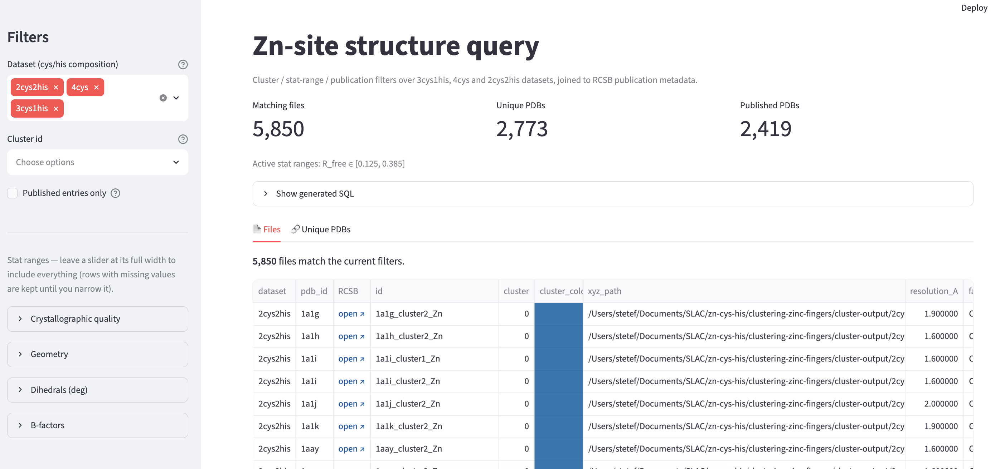

<div align="center">


# 🧬 zn-cys-his

**Clustering & X-ray spectra analysis of four-coordinate Zn(Cys/His) metal sites, mined from the RCSB PDB.**

[](https://zn-cys-his.streamlit.app)


</div>

Cleaned zinc-pocket structures go in → they're **clustered** by local geometry across
cys/his compositions → cluster representatives are sampled for **XANES/EXAFS spectra** →
and everything is explorable through an interactive **query app**. Split out of the
larger `pdb-scraper` project so the clustering reruns cleanly in isolation.

## 🚀 Live demo

> ### [**Open the structure-query app →**](https://zn-cys-his.streamlit.app)
> Filter thousands of clustered Zn sites by geometry, cluster, and RCSB publication
> metadata — with clickable structure links and CSV export. No install required.

<div align="center">

</div>

## ⚡ Quickstart

```bash
uv sync                                                # install deps + package into .venv
uv run zch-pipeline --base-dir data/4cys-large         # prep → cluster → validate
uv run streamlit run src/zn_cys_his/query_app/app.py   # explore the results locally
```

Dependencies are intentionally minimal: `numpy`, `scikit-learn`, `matplotlib`, `plotly`,
`pandas`, `tqdm`, plus `streamlit` + `requests` for the query app.

## 🔬 Clustering pipeline

`prep` (annotate + stats) → `cluster` (featurize + k-means) → `validate` (RMSD, plots,
PCA→XYZ). Idempotent — it skips work whose output exists; pass `--force` to redo.

```bash
uv run zch-pipeline --base-dir data/4cys-large       # full run → cluster-output/4cys-large/
uv run zch-pipeline --base-dir data/2cys2his-large   # any composition — auto-detected
```

<details>
<summary><b>Rerun a single stage · where artifacts land · full docs</b></summary>

<br>

```bash
uv run zch-pipeline --base-dir data/4cys-large --stage cluster --approaches 3  # re-cluster approach 3 only
uv run zch-pipeline --base-dir data/4cys-large --stage validate               # redo validation / plots
uv run zch-pipeline --base-dir data/4cys-large --from-stage cluster           # cluster + validate, skip prep
```

Artifacts land under `cluster-output/<dataset>/{prep,approach1,approach3,validation}/`
(override the root with `--out-dir`); each approach auto-emits `cluster_pdb_family.csv`.
See [docs/pipeline.md](docs/pipeline.md) for every step, featurization approach, and parameter.

</details>

## 📈 Spectra

```bash
uv run zch-sample-spectra   # sample cluster reps (protonated, CHARGE/MULTIPLICITY tagged)
uv run zch-plot-spectra     # XANES / EXAFS / χ(R) overlays + interactive report
```

<details>
<summary><b>Charge model · other datasets</b></summary>

<br>

`zch-sample-spectra` samples representatives from the 4cys clustering
(`cluster-output/4cys-large/approach1`). Charge is derived per structure as `2 − n_cys`
(4cys −2, 3cys1his −1, 2cys2his 0, 1cys3his +1, 4his +2); multiplicity 1 — override with
`--charge`/`--multiplicity` or skip via `--no-charge-mult`. `zch-plot-spectra` reads the
precomputed FEFF spectra in `data/4cys-large/calculated-spectra/` and writes the
report/overlays to a sibling `analysis-and-visualization/`. To target another dataset,
pass `--station` / `--approach` / `--out` (generate its precomputed spectra first).

</details>

## 🔎 Query app

The [live demo](https://zn-cys-his.streamlit.app) runs off the prebuilt
`src/zn_cys_his/query_app/structures.db`. Rebuild it after a fresh pipeline run (once new
`approach1/kmeans_labels_with_stats.csv` files exist), then relaunch:

```bash
uv run zch-build-db
uv run streamlit run src/zn_cys_his/query_app/app.py
```

App-specific details live in [query_app/README.md](src/zn_cys_his/query_app/README.md).

## 🛠️ Console scripts

| Command | Purpose |
|---|---|
| `zch-pipeline` | run the full clustering pipeline |
| `zch-fetch-pdbs` | download source PDBs from RCSB *(run automatically by prep)* |
| `zch-sample-spectra` | sample cluster representatives for spectra |
| `zch-plot-spectra` | plot XANES/EXAFS/χ(R) + interactive report |
| `zch-build-db` | rebuild the query app's SQLite DB |

Each is equivalent to `uv run python -m <module>` (see [pyproject.toml](pyproject.toml)).

<details>
<summary><b>📂 Repository layout</b></summary>

<br>

```
src/zn_cys_his/            # installable package (src layout)
  paths.py                 # REPO_ROOT / DATA_DIR / CLUSTER_OUTPUT + mirror_output()
  clustering/              # the clustering pipeline, driven by orchestrate.py
    orchestrate.py         # stage runner: prep -> cluster -> validate
    utils.py               # shared module imported by every step
    step01_annotate_secstruct.py   # tag CA atoms with SEC= from the PDB
    step02_compute_stats.py        # per-structure metadata + family string
    step03_approach1_cartesian.py  # aligned-Cartesian featurization + clustering
    step04_approach2_zmatrix.py    # Z-matrix featurization (optional)
    step05_approach3_piv.py        # PIV featurization + clustering
    step06_validate_clusters.py    # RMSD metrics, plots, PCA→XYZ, comparison
  spectra/                 # sample cluster representatives + plot XANES/EXAFS/χ(R)
  query_app/               # Streamlit app + its prebuilt structures.db / csv / cache
data/                      # READ-ONLY inputs (gitignored, kept locally)
  <dataset>/xyz-files/     # raw pocket XYZ            (version-controlled)
  <dataset>/pdb-files/     # source .pdb files         (NOT versioned; zch-fetch-pdbs)
  4cys-large/calculated-spectra/   # precomputed FEFF spectra  (version-controlled)
cluster-output/            # ALL generated artifacts, mirroring data/ (gitignored)
  <dataset>/prep/          # annotated XYZ copies + structure_stats.csv
  <dataset>/approach{1,2,3}/  validation/   # clustering outputs + validation
docs/
  pipeline.md              # detailed pipeline writeup + quick command reference
  filtering.md             # gather/clean filtering funnel per dataset
```

- **Step modules are numbered in `orchestrate.py`'s run order** (annotate → stats →
  approaches → validate); Python module names can't start with a digit, hence `stepNN_`.
- **Inputs vs. outputs.** `data/` is read-only input; everything generated lands in
  `cluster-output/<dataset>/`, mirroring `data/`. Input XYZ files are never modified —
  wipe a run with `rm -rf cluster-output/<dataset>`.
- **Version control.** Small, hard-to-regenerate text inputs are committed: `xyz-files/`
  and `calculated-spectra/` (FEFF output, ~11 MB). The large, re-downloadable
  `pdb-files/` (~2 GB) are **not** — prep repopulates them from RCSB (`zch-fetch-pdbs`,
  once), so a fresh clone only needs a network connection. `cluster-output/` is never committed.

</details>

---

<div align="center">
<sub>Built at <b>SLAC National Accelerator Laboratory</b> · Zn(Cys/His) metal-site analysis · MIT licensed</sub>
</div>
